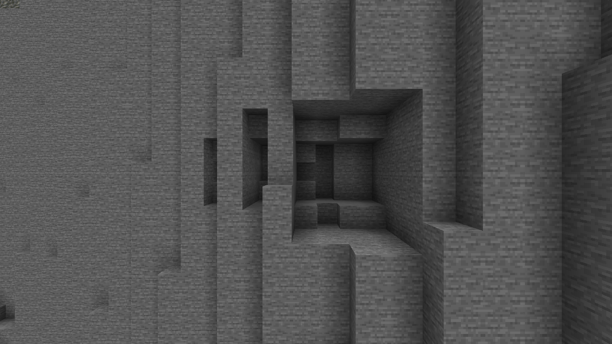

# 0.6.0-dev.3 — Massif finishing and exterior cliff erosion

Implementation and validation report, 11 September 2026.

## 1. Starting state

Repository: `C:\Modding\Minecraft\Minecraft-Dune`.
Starting HEAD: `8af60b8` — `0.6.0-dev.2.1 - World validation and terrain compatibility`.
The working tree was clean; dev.2.1 was already committed. Work continued from that local
implementation. No commit, staging, push, merge, reset or stash was performed. Synced project
reference files and the supplied prompt/roadmap were not edited.

## 2. Version and component status

Mod version **0.6.0-dev.3**, terrain profile **6000**, terrain algorithm revision **3**.

| Component | Implementation status | Scope |
| --- | --- | --- |
| Talus material/transport/stability correction | Fully implemented | Coherent source clasts, bounded routes, slope response, denser source integration. |
| Modest erosion increase | Fully implemented | Weak-unit morphology work; no global resistance reduction. |
| Summit and major fissure refinement | Fully implemented | Broad lowering, variable surface incision/wander, finite tapered splays. |
| Exterior cliff cavities | Fully implemented as a conservative first layer | Sparse supported undercuts/alcoves; an uncommon larger candidate family. |
| Composer and saved-algorithm compatibility | Fully implemented | Shared occupancy and preserved revision-1/2 formulas. |
| Runtime generation/save/reload validation | Fully implemented | Final run passed; all eight actual frames inspected. |
| Cavity debris contribution | Deferred | Existing heightfield erosion remains the talus supply source. |
| General caves, physical collapse, shallow-joint population | Deferred | Outside this release. |
| Deliberately routed branch reconnections | Deferred | Existing branches can intersect; no new explicit reconnection solver. |

These statuses describe implementation, not a claim that visual tuning is final.

## 3. Talus root cause

The historical `TalusColluviumField.materialAt` selector made source lithology the exception
and gravel the fallback. A spatial sample of its proximal selector produced only **24.5%**
source material. Its four-block source grid could also miss an entire two-block-wide source,
and source height/direction did not establish an unobstructed downhill route. Deposit
eligibility did not adequately distinguish a stable toe from an exposed steep recipient.

## 4. Talus algorithm changes

Revision 3 uses `StableTalusField`; revisions 1/2 retain the original field. Source clasts use
a coherent 3D patch selector with a proximal threshold of 0.82 that decreases by up to 0.4
distally. The existing source-material palette/fallback and distal-sand rule remain in place.
The source is the strongest contributor from the eroded geological surface.

Source integration now samples a fixed two-block lattice with four times the previous area
normalization. This improves narrow-source coverage without multiplying the supply. In the
translated two-block-band check, every offset deposits, and the minimum/maximum tendency is
**0.928**, compared with complete misses on some historical offsets. One-block-wide sources
can still alias; this is a reduction of grid sensitivity, not its complete elimination.

## 5. Material and coverage measurements

| Selector sample | Source-rock share | Gravel share before the separate distal-sand rule |
| --- | ---: | ---: |
| Historical proximal | 24.5% | 75.5% |
| Dev.3 proximal | 75.4% | 24.6% |
| Dev.3 middle | 65.1% | 34.9% |
| Dev.3 distal | 50.0% | 50.0% |

These are broad spatial selector samples at fixed distance fractions, not whole-world block
fractions. A separate native wall sample at X=3032..3120, Z=128..192, step 8, had **40 → 14**
columns with deposits. Its dev.3 deposit blocks included **9 source clasts and 9 gravel**;
this small mixed-distance sample must not be presented as 75% native clast coverage. Exposed
geology remains visible because fewer steep recipients retain deposits and local material
selection is no longer predominantly gray gravel.

## 6. Obstruction and stability

Routes sample the analytical post-erosion terrain at bounded two-block intervals within the
existing reach (preset 16, codec maximum 24). They track the lowest surface reached and reject
subsequent rises of two blocks, with a smooth penalty from 0.5 to 2 blocks. Thus a ledge followed
by a drop is valid; a ridge or a climb out of a trough is not. Routes do not query generated
blocks or other deposits. Very narrow intervening obstacles can fall between samples.

Recipient stability uses the steepest sampled downhill gradient, so an adjacent uphill cliff
does not incorrectly disqualify its toe. Moderate slopes retain some debris; very steep
downhill faces approach zero retention. Local concavity provides a small preference for
pockets. Coherent broad patches and distance/direction kernels remain. Yield, reach and the
four-block maximum thickness are unchanged. Deposits are generated once, with no cleanup.

## 7. Erosion strength

The existing `RockErosionField` and `WallErosionMorphology` remain authoritative. A maximum
15% additional morphology work is gated by weak-unit susceptibility, with stronger emphasis
on local recesses and vertical gully work. Hard formations retain their existing resistance;
erosion still integrates through the strata reached. In the native wall sample, aggregate
removed height was **1.081 times dev.2**. This 8.1% result includes the combined finishing
changes and is not an isolated measurement of the 15% budget control.

## 8. Summit relief

`SummitWeatheringField` produces coherent bowls/ridges using broad fields with a preset
180-block main scale. It only lowers exposed massif summits, fades toward steep faces, and
responds to lithology. Preset additional removal is bounded at eight blocks; the native summit
sample measured **0.93..7.31 blocks**. No piles are added, R0 and S remain unchanged, and the
lowering enters the same erosion calculation as the refined fissures. There is no flattening
or repair pass after fissure generation.

## 9. Fissures and branches

`MassifFractureField.surface` reuses the existing seeded families, warped primary traces,
finite two-segment branches and geological metadata. Coherent depth variation can nearly
close a segment and reopen it later; the sampled multiplier ranged **0.150..1.213**. Surface
width follows this variation. Additional coherent lateral wandering has a five-block maximum
before its strength setting. Branch attachment follows the wandered parent.

Surface branch probability increases modestly, remains bounded, and preserves existing varied
lengths/angles/widths. The terminal segment tapers its incision to zero at its finite endpoint.
Existing intersections remain possible; purposeful reconnection routing is deferred. The
historical structural entry point passes zero surface variation and retains its old output.

## 10. Cavity architecture

The operation remains an analytical dependency graph:

```text
raw geology + independent sediment -> analytical exposure -> RockErosionField -> Re
Re + heightfield erosion supply -> stable talus
Re + lithology + fractures -> sparse exterior cavity masks
Re + cavity masks + sediment + talus -> shared column composer
```

`ExposedCliffCavityField` is a dedicated local detail stage. It places at most one candidate
per deterministic 64-block cell, estimates a cardinal inward direction from the Re gradient,
and rejects non-massif, buried, flat, low-relief and insufficiently supported candidates.
Generated cave air never becomes an exposure input. The original 2.5D field still establishes
the wall silhouette; the cavity stage only removes a bounded subset beneath it.

## 11. Exterior connection and supports

Each tangent/height lane begins in analytical exterior air. Once it reaches rock, only a
contiguous prefix can be removed; a failed resistance/support/depth check stops that lane
permanently. Noise modulates the available budget, never selects isolated internal voxels.
Original air before the face must also clear the maximum possible local talus thickness and
sediment, so downstream composition cannot seal the intended entrance.

Every removed lane retains a common roof plane with at least three blocks of rock through to
an uncut back wall. At least three blocks at the rear of the sampled feature remain uncarved.
Five-block cell-edge margins retain ten-block separation between neighboring cells' cuts.
The floor below each feature is untouched. These geometric constraints avoid detached slabs
and paper-thin roofs without orphan filters, collapse simulation or connected-component cleanup.

## 12. Undercuts, alcoves and cavern mouths

Typical candidates have a 4–7-block maximum height and 10–14-block nominal width; 15% of
candidates use the larger family, up to 12 blocks tall and 22 wide. Elliptical side/vertical
taper, resistance, local face shape, roof support and entrance clearance reduce the surviving
opening. Penetration is capped at 12 carved rock blocks in the preset. Frequency 0.4 describes
a pre-geometry candidate probability, not 40% of cliff coverage.

The conservative geometry often produces small undercuts or alcoves. Large native cavern
mouths are not guaranteed within any local inspection area. This is not a general underground
cave network, and roof-breaking cavity openings are intentionally excluded in this first layer.
The bounded Seed-0 southern search found only two surviving features, of **97 and 6 removed
blocks**. These validate a small alcove and a tiny undercut, not a large natural cavern mouth.
The larger candidate family is implemented, but its native visual acceptance remains unproven.

## 13. Lithology, fractures and debris accounting

Soft/loose, medium, hard and very-hard units consume successively more cavity work per block
(0.8, 1.15, 2.5 and 4.5). The exposed material remains the existing geological unit. Fracture/
fault damage modestly increases candidate probability and penetration budget without creating
unrestricted fracture caves. Hard units can remain above recessed softer material.

Cavity volume is **not** added to talus supply in dev.3. This follows the prompt's permitted
compromise: first establish restrained, reachable deposits, then consider a bounded additional
source term. There is no claim of exact mass conservation.

## 14. Performance

Expensive cavity work is limited to accepted face candidates and their bounded vertical
intervals. A candidate checks at most 23 tangent lanes, each with a 41-point surface profile,
and at most 16 height bits. Full columns then use a constant-time occupancy bit lookup rather
than evaluating cavity noise at every underground Y.

All caches are operation-local and bounded: the existing raw cache is at most 1,024 entries,
the new eroded-stage cache at most four times the requested capacity, and the cavity cache at
most 16 features. Single-column/base-height operations calculate only their relevant tangent
lane. Disabled caches and saturated caches preserve output. A `CAVITY_FEATURE` metrics stage
counts full feature evaluations; it does not count the separate single-lane query path.

The final clean-build analytical benchmark, with warm-up and alternating order across two
16×16 wall tiles, measured **22.30 ms dev.2 / 64.77 ms dev.3 (2.90×)**. This is a material local
cost increase, principally associated with denser source/route evaluation and cavity detail.
It is not whole-game throughput or a Distant Horizons benchmark. No claim is made that the
informal earlier 70–85 chunks/sec observation is preserved. Profiling representative world
generation is a high-priority follow-up.

## 15. Added files/classes

- `worldgen/geology/StableTalusField.java`
- `worldgen/geology/SummitWeatheringField.java`
- `worldgen/geology/ExposedCliffCavityField.java`
- `src/test/java/com/blackenter/minecraftdune/worldgen/arrakis/MassifFinishingValidation.java`
- `src/test/resources/terrain/arrakis_6000_dev3.json`
- This implementation report.
- Fourteen preserved runtime evidence files under `docs/validation/0.6.0-dev.3`.

Production package paths above are relative to `src/main/java/com/blackenter/minecraftdune`.

## 16. Changed files/classes

- Version/preset: `gradle.properties`, `arrakis_dev.json`.
- Worldgen settings/dispatch: `TerrainAlgorithm`, `BuriedRockSettings`, `BuriedRockTerrain`.
- Shared composition/inspection: `BuriedTerrainColumn`, `ArrakisTerrainEvaluator`,
  `ArrakisTerrainCommand`, `TerrainGenerationMetrics`.
- Existing morphology integration: `RockErosionField`, `MassifFractureField`.
- Runtime harness: `ArrakisRuntimeValidation`, `ArrakisValidationClient`.
- Tests: `TerrainAlgorithmValidation`, `BuriedRockTerrainValidation`.
- Documentation: `README.md`, `PATCH_NOTES.md`, `README-Arrakis-Dev.txt`,
  `docs/ARRAKIS_TERRAIN_PROFILE.md`.

Historical report files, launcher scripts, terrain profile number, macro fault architecture,
basin/dune settings, fauna and the general camera system were preserved.

## 17. Compatibility

Revisions 1/2 remain supported with their historical formulas. Their fixture data and expected
fingerprints were not changed. Revision 3 alone enables finishing. The codec rejects unknown
revisions and attempts to enable finishing under historical revisions; ambiguous unversioned
dev.2 settings remain rejected. Unambiguous unversioned dev.1 settings still resolve to 1.

Frozen SHA-256 fingerprints:

```text
dev1:  bc6249591a68032b5712cf37b461a05f7dcc950b1a60e7a39c99e6621a034896
dev2:  7819b1b4bb61528742bf701dbe686a812f5fe9cf2c513a19b8cdb59acd817696
dev3:  6027a1f35b2b7f6f65f46dbed15f6393af38e24147125c6db7cc7a36396f28f6
```

The separately frozen dev.2 saved-defaults fixture also matches its original dev.2 hash.
Dev.3 adds native cavity columns to its fingerprint coverage without altering old coverage.

## 18. Tests

New checks cover material sorting, ridge blocking, clear downhill routes, toe/moderate/steep
stability, translated narrow sources, coherent fissure depth, the actual production terminal
segment, negative-coordinate boundary continuity, and bounded summit lowering.

Cavity tests checked **43 synthetic features / 21,067 removed voxels** across four normals,
negative cells and multiple seeds. Every tested voxel has a continuous external lane, bounded
penetration and a roof connected to its back wall. Harder lithology never removes more than
the paired soft cliff. Flat exposed plateaus and buried basins produce no features. Native
cavity columns agree across cache capacities 0/1/64/1024 and the column writer/query APIs.

The old solid-below-Re assertions still run against the frozen revision-2 fixture. Revision 3
instead requires every sub-Re air cell to be an authorized cavity and checks composer/height
parity. Old morphology and legacy terrain validations remain enabled.

## 19. Commands

Principal validation commands from the repository root:

```powershell
git status --short
git log -5 --oneline
.\gradlew.bat test
.\gradlew.bat clean build
.\gradlew.bat test jar
git diff --check
powershell -NoProfile -ExecutionPolicy Bypass -File scripts/Test-ArrakisRuntime.ps1
git rev-parse --short HEAD
git diff --cached --name-only
```

`clean build` includes `validateBuriedRock`, `validateArrakisTerrain`,
`validateArrakisEvaluator`, `validateDunePrototypeState`, launcher tests and `test`.
The runtime script launches `runTerrainValidationClient` once for generation and once for
reload, passing a unique folder and the corresponding phase as Gradle properties.

## 20. Build/test results

`test` passed in 23 seconds. `clean build` passed in **7 minutes 16 seconds**, including all
registered terrain validators and launcher regression checks. `git diff --check` passed.
The build emitted existing Gradle deprecation notices. After that build, the first runtime
attempt exposed a summit screenshot-target problem: a fixed Y205 target could remain in an
occluded subterranean section. The new summit view now checks its loaded surface height while
retaining all render-settle conditions. The original four targets are unchanged. Terrain
formulas did not change; `test jar` passed in **24 seconds** and rebuilt the final camera correction.
Output: `build/libs/minecraftdune-0.6.0-dev.3.jar`.

## 21. Runtime validation

**Passed** in the final isolated world `Arrakis-validation_20260911_202812_95ec7b50`.
Both `generate.passed` and `reload.passed` exist. The generation and reload reports are also
byte-for-byte identical after copying to the evidence directory.

| Check | Per phase |
| --- | ---: |
| Complete chunks | 11 (nine original probes plus two cavity chunks) |
| Columns | 2,816 |
| Actual block/base-column comparisons | 1,081,344 |
| Heightmap/base-height comparisons | 8,448 |
| Explicit cavity air blocks | 103 |
| Settings | Seed 0, profile 6000, algorithm revision 3 |

The three heightmap types are WORLD_SURFACE, OCEAN_FLOOR and MOTION_BLOCKING. Reload verified
that each target chunk existed on disk before requesting it, then compared the complete
settings and per-chunk hashes. Both clients saved all dimensions before stopping.

The first attempt passed block comparisons but timed out at the original fixed summit
screenshot target. The second saved its block report, then the client closed before capture,
without a validation exception; its cause is unknown. The final retry completed both phases.
Synchronous million-block validation produced an expected server-overload log warning; this
is not a measurement of normal gameplay responsiveness.

Preserved evidence: [generation report](validation/0.6.0-dev.3/generated.json),
[reload report](validation/0.6.0-dev.3/reloaded.json),
[generation/camera manifest](validation/0.6.0-dev.3/generate-capture-manifest.json),
[generation marker](validation/0.6.0-dev.3/generate.passed),
[reload marker](validation/0.6.0-dev.3/reload.passed).

## 22. Visual validation

All eight final **1280×720 actual Minecraft frames were inspected**. The capture used
Minecraft 1.21.1, NeoForge 21.1.248 and Minecraft: Dune 0.6.0-dev.3 on the RTX 3080 Ti,
with no Distant Horizons, shaders or additional mods. Render distance was 12, clouds off,
day time 6000, with the GUI hidden. Cameras wait for nearby chunks and render settling.
The corrected summit target resolved to surface Y218 in this world.

| Frame | Observed result / limit |
| --- | --- |
| [Inner wall](validation/0.6.0-dev.3/inner-wall.png) | Strong exposed frontage and vertical relief remain visible. |
| [Cliff foot](validation/0.6.0-dev.3/cliff-foot.png) | Geological material dominates the face; debris is localized. |
| [Shoulder](validation/0.6.0-dev.3/shoulder.png) | Stepped shoulder relief and major incised fissures are visible. |
| [Outer wall](validation/0.6.0-dev.3/outer-wall.png) | Near frontage remains detailed; distant sections are visibly clipped. |
| [Summit](validation/0.6.0-dev.3/summit.png) | Gentle height steps and broad lithology exposures; large flat-looking areas remain. |
| [Southern wall](validation/0.6.0-dev.3/southern-wall.png) | Local frontage/recesses visible; the wider outline is limited by draw distance. |
| [Southern cavity 1](validation/0.6.0-dev.3/southern-cavity-1.png) | A clear small alcove, exposed back/floor and retained roof; shape is still angular. |
| [Southern cavity 2](validation/0.6.0-dev.3/southern-cavity-2.png) | Tiny undercut openings in harder material, easy to miss at medium distance. |

The close cavity view establishes that true undercuts render in the composed world. These
frames do not establish a large-cavern population or final aesthetic acceptance of summit/
fissure naturalness. Far silhouettes in the clipped views must not be used to judge wall
continuity. More seeds, sectors and full-distance visual comparisons remain useful.



## 23. Known limitations

- Measured analytical generation cost is higher; real-game/DH throughput is not benchmarked.
- Cavity orientation is cardinal and placement uses conservative fixed cells. Large native
  mouths can be rare, openings can look angular, and top-breaking openings are excluded to retain continuous roofs.
- Cavity debris supply, full caves, structural collapse and a general shallow-joint layer are deferred.
- Talus obstruction sampling can miss sub-step barriers; one-block sources can still alias.
- Selector statistics are not global material proportions; more seed/sector sampling is useful.
- Summit changes are subtle and large flat-looking areas remain. Wider screenshot views have
  visible far-section clipping; only their nearby terrain is accepted as local visual evidence.
- Explicit branch reconnection routing and full macro-fault trace naturalization are deferred.
- Existing chunks are never rewritten. Use a fresh revision-3 world for comparisons.

## 24. Recommended dev.4 priorities

1. Profile actual generation and DH workloads across basin, cliffs and summits; reduce repeated
   source/route work while retaining deterministic revision behavior.
2. Review more seeds and southern/outer-wall sectors, especially native cavity size/frequency,
   source-colored talus visibility and summit/fissure readability.
3. Consider oblique cavity faces with equally strong exterior/roof guarantees and a bounded
   cavity-supply term only if deposits remain restrained.
4. Add shallow joints or deliberate branch reconnections after major fissure acceptance.
   Keep full cave networks/collapse as separately scoped architecture work.

Future changes to generated output require a new terrain algorithm revision and preservation
or explicit rejection of old revisions, even if profile 6000 remains unchanged.
